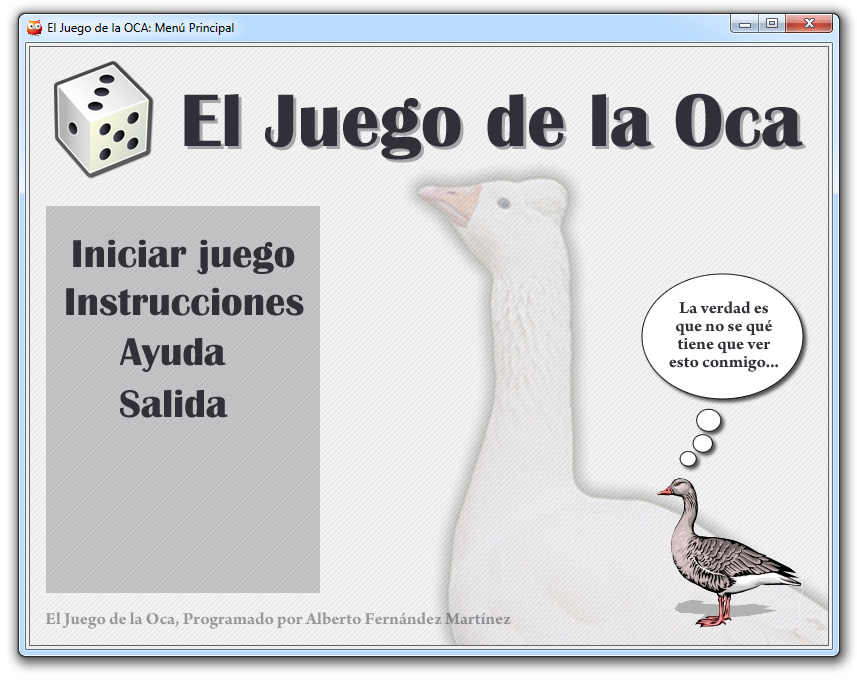
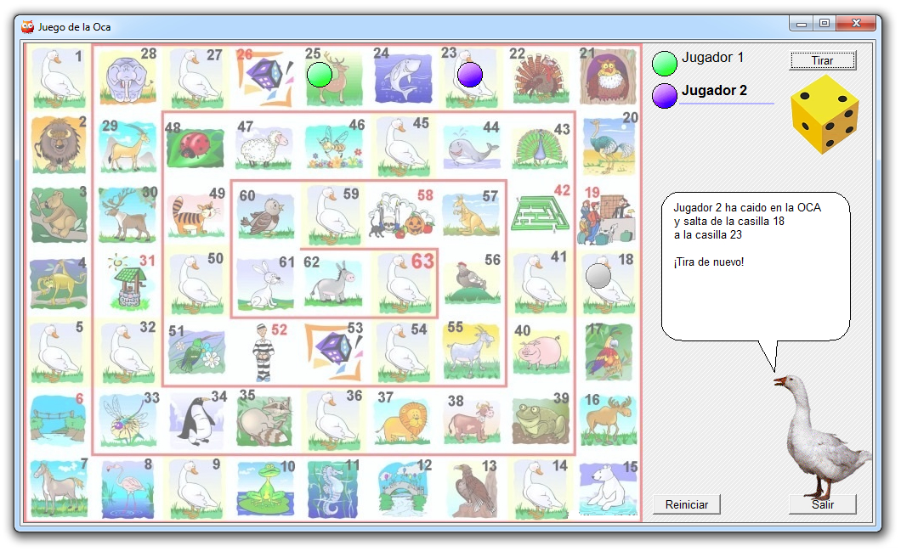

Game of the Goose
=================

"Oca" is the traditional Spanish game, programmed in Prolog + XPCE

Requirements
------------

The game requires SWI-Prolog with XPCE support. On macOS, the official
`SWI-Prolog.app` bundle provides both the Prolog runtime and the native GUI.

Run the game from the project directory:

```sh
make run
```

The Makefile automatically uses `/Applications/SWI-Prolog.app` on macOS when
it is installed there. If `swipl` is already on your `PATH`, this command also
works:

```sh
swipl -s oca.pl
```

Tests
-----

The PlUnit suite covers game-state initialization, player configuration,
board data, movement and bouncing, turn handling, every special-square event,
resource loading, dialogue wrapping, and XPCE components built off-screen.

Run all tests:

```sh
make test
```

Run the tests with clause coverage:

```sh
make coverage
```

Coverage must remain at or above 85% for the application files. Run every
local quality check with:

```sh
make check
```

Architecture
------------

- `oca.pl` contains application startup, mutable session state, and the XPCE
  interface.
- `src/oca_board.pl` contains immutable board coordinates and square events.
- `src/oca_rules.pl` contains pure movement, scheduling, jail, pairing, and
  player-validation rules.
- `tests/` contains the PlUnit suite and reusable XPCE test fixtures.

The artwork uses fixed pixel coordinates, so the menu and game windows are
intentionally non-resizable. Player names are trimmed, must be unique, and
may contain at most 20 characters.

If you want to know more about the "Oca":

https://en.wikipedia.org/wiki/Game_of_the_Goose

Screenshots
-----------




